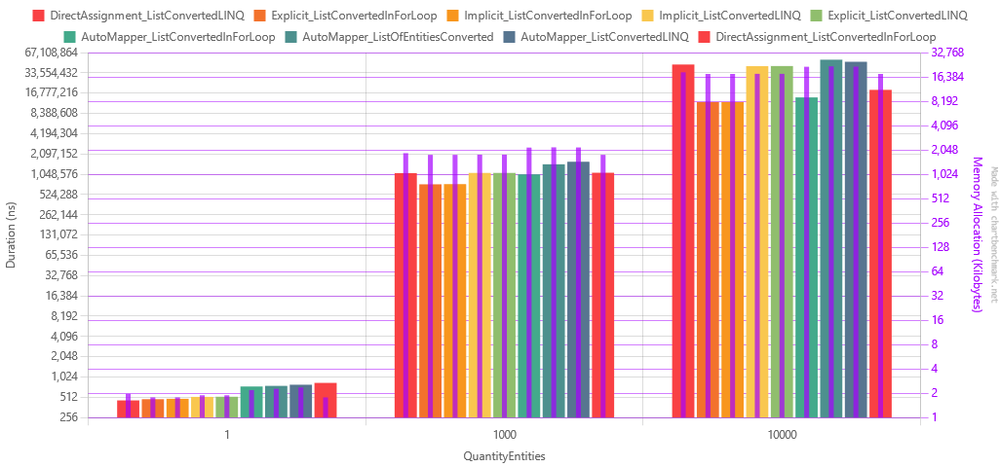

[Readme](./readme.md) > [AutoMapper Benchmark](./automapperbenchmark.md)

# AutoMapper Composite Benchmark
## Entity
```csharp
public record Purchase
{
    public Guid Id { get; set; }
    public User User { get; set; }
    public DateTime PurchaseDate { get; set; }
    public bool AnomalyDetected { get; set; }
    public Address ShippingAddress { get; set; }
    public IList<Product> Items { get; set; }
}
```

```csharp
public record Product
{
    public Guid Id { get; set; }
    public string Name { get; set; }
    public string Description { get; set; }
    public float BaseValue { get; set; }
    public float TaxPercent { get; set; }
    public DateTime CreatedAt { get; set; }
}
```

```csharp
public record User
{
    public Guid Id { get; set; }
    public string Name { get; set; }
    public DateTime BirthDate { get; set; }
    public bool IsActive { get; set; }
    public float RewardPoints { get; set; }
    public DateTime LastAccessed { get; set; }
}
```

```csharp
public record Address
{
    public Guid Id { get; set; }
    public string Street { get; set; }
    public string City { get; set; }
    public string State { get; set; }
    public string ZipCode { get; set; }
}
```


## Models 
```csharp
public record PurchaseModel
{
    public Guid Id { get; set; }
    public UserModel User { get; set; }
    public DateTime PurchaseDate { get; set; }
    public bool AnomalyDetected { get; set; }
    public AddressModel ShippingAddress { get; set; }
    public IList<ProductModel> Items { get; set; }
}
```

```csharp
public record ProductModel
{
    public Guid Id { get; init; }
    public string Name { get; init; }
    public string Description { get; init; }
    public float FinalValue { get; init; }
}
```

```csharp
public record UserModel
{
    public Guid Id { get; set; }
    public string Name { get; set; }
    public DateTime BirthDate { get; set; }
    public bool IsActive { get; set; }
    public float RewardPoints { get; set; }
    public DateTime LastAccessed { get; set; }
}
```

```csharp
public record AddressModel
{
    public Guid Id { get; set; }
    public string Street { get; set; }
    public string City { get; set; }
    public string State { get; set; }
    public string ZipCode { get; set; }
}
```

## Results
For this benchmark, every Purchase instance has 25 Products, 1 User and 1 Address.

| Method                                  | QuantityEntities |            Mean |         Error |          StdDev |             Min |             Max |          Median | Rank |      Gen0 |      Gen1 |     Gen2 |   Allocated |
|-----------------------------------------|------------------|----------------:|--------------:|----------------:|----------------:|----------------:|----------------:|-----:|----------:|----------:|---------:|------------:|
| DirectAssignment_ListConvertedLINQ      | 1                |        460.4 ns |       9.10 ns |        18.79 ns |        433.7 ns |        507.3 ns |        462.4 ns |    1 |    0.3209 |    0.0014 |        - |     1.97 KB |
| Explicit_ListConvertedInForLoop         | 1                |        480.3 ns |       8.58 ns |         8.03 ns |        470.2 ns |        493.6 ns |        479.3 ns |    2 |    0.2899 |    0.0010 |        - |     1.78 KB |
| Implicit_ListConvertedInForLoop         | 1                |        487.0 ns |       9.68 ns |        14.79 ns |        467.0 ns |        528.1 ns |        487.4 ns |    2 |    0.2899 |    0.0010 |        - |     1.78 KB |
| Implicit_ListConvertedLINQ              | 1                |        520.1 ns |       6.94 ns |         6.49 ns |        511.2 ns |        533.3 ns |        519.3 ns |    3 |    0.3080 |    0.0019 |        - |     1.89 KB |
| Explicit_ListConvertedLINQ              | 1                |        521.2 ns |       6.52 ns |         5.78 ns |        512.3 ns |        534.2 ns |        520.9 ns |    3 |    0.3080 |    0.0019 |        - |     1.89 KB |
| AutoMapper_ListConvertedInForLoop       | 1                |        741.8 ns |      14.20 ns |        17.43 ns |        715.2 ns |        781.3 ns |        738.0 ns |    4 |    0.3567 |    0.0019 |        - |     2.19 KB |
| AutoMapper_ListOfEntitiesConverted      | 1                |        756.9 ns |      14.49 ns |        32.71 ns |        715.7 ns |        838.0 ns |        748.1 ns |    4 |    0.3710 |    0.0029 |        - |     2.27 KB |
| AutoMapper_ListConvertedLINQ            | 1                |        786.6 ns |      15.64 ns |        21.92 ns |        754.1 ns |        828.2 ns |        777.2 ns |    5 |    0.3843 |    0.0029 |        - |     2.36 KB |
| DirectAssignment_ListConvertedInForLoop | 1                |        837.5 ns |      10.00 ns |         9.35 ns |        825.4 ns |        855.0 ns |        835.3 ns |    6 |    0.2899 |    0.0010 |        - |     1.78 KB |
| Explicit_ListConvertedInForLoop         | 1000             |    743,806.8 ns |  13,896.01 ns |    19,021.01 ns |    705,909.9 ns |    780,629.8 ns |    739,988.0 ns |    7 |  290.0391 |    0.9766 |        - |  1781.25 KB |
| Implicit_ListConvertedInForLoop         | 1000             |    747,336.7 ns |  14,678.90 ns |    24,117.85 ns |    715,463.0 ns |    804,557.9 ns |    740,325.2 ns |    7 |  290.0391 |    0.9766 |        - |  1781.25 KB |
| AutoMapper_ListConvertedInForLoop       | 1000             |  1,046,117.1 ns |  20,830.01 ns |    39,123.81 ns |    979,501.2 ns |  1,137,604.5 ns |  1,044,978.5 ns |    8 |  355.4688 |    1.9531 |        - |   2187.5 KB |
| DirectAssignment_ListConvertedLINQ      | 1000             |  1,089,462.9 ns |  21,465.83 ns |    21,082.31 ns |  1,049,762.7 ns |  1,122,836.1 ns |  1,089,118.0 ns |    9 |  304.6875 |  152.3438 |        - |  1867.29 KB |
| Implicit_ListConvertedLINQ              | 1000             |  1,095,563.1 ns |  21,856.90 ns |    44,647.85 ns |  1,029,653.7 ns |  1,201,921.7 ns |  1,090,228.3 ns |    9 |  291.0156 |  144.5313 |        - |  1789.17 KB |
| Explicit_ListConvertedLINQ              | 1000             |  1,096,541.3 ns |  21,623.52 ns |    39,539.82 ns |  1,023,014.4 ns |  1,179,460.3 ns |  1,094,817.2 ns |    9 |  291.0156 |  144.5313 |        - |  1789.17 KB |
| DirectAssignment_ListConvertedInForLoop | 1000             |  1,103,554.1 ns |  21,834.34 ns |    33,993.44 ns |  1,044,160.5 ns |  1,160,184.0 ns |  1,092,382.4 ns |    9 |  289.0625 |         - |        - |  1781.25 KB |
| AutoMapper_ListOfEntitiesConverted      | 1000             |  1,472,365.9 ns |  28,602.18 ns |    34,048.86 ns |  1,419,022.7 ns |  1,567,327.5 ns |  1,464,619.9 ns |   10 |  359.3750 |  179.6875 |        - |  2203.71 KB |
| AutoMapper_ListConvertedLINQ            | 1000             |  1,606,671.0 ns |  31,987.52 ns |    42,702.42 ns |  1,543,430.5 ns |  1,698,284.4 ns |  1,595,467.6 ns |   11 |  357.4219 |  177.7344 |        - |  2195.48 KB |
| Explicit_ListConvertedInForLoop         | 10000            | 12,347,253.0 ns | 133,922.51 ns |   118,718.82 ns | 12,194,251.6 ns | 12,615,589.1 ns | 12,361,163.3 ns |   12 | 2906.2500 |   15.6250 |        - | 17812.52 KB |
| Implicit_ListConvertedInForLoop         | 10000            | 12,353,892.8 ns | 218,626.71 ns |   204,503.56 ns | 12,118,206.2 ns | 12,725,765.6 ns | 12,341,317.2 ns |   12 | 2906.2500 |   15.6250 |        - | 17812.52 KB |
| AutoMapper_ListConvertedInForLoop       | 10000            | 14,497,895.5 ns | 174,303.49 ns |   154,515.50 ns | 14,221,687.5 ns | 14,730,001.6 ns | 14,518,882.8 ns |   13 | 3562.5000 |   15.6250 |        - | 21875.02 KB |
| DirectAssignment_ListConvertedInForLoop | 10000            | 18,740,508.3 ns | 219,020.12 ns |   204,871.56 ns | 18,378,931.2 ns | 19,134,950.0 ns | 18,707,928.1 ns |   14 | 2906.2500 |         - |        - | 17812.55 KB |
| Implicit_ListConvertedLINQ              | 10000            | 42,198,024.6 ns | 573,041.66 ns |   536,023.53 ns | 41,089,953.8 ns | 42,832,715.4 ns | 42,352,138.5 ns |   15 | 3076.9231 | 1230.7692 | 230.7692 | 17891.06 KB |
| Explicit_ListConvertedLINQ              | 10000            | 42,381,709.2 ns | 388,521.84 ns |   363,423.57 ns | 41,865,776.9 ns | 43,248,538.5 ns | 42,259,530.8 ns |   15 | 3076.9231 | 1230.7692 | 230.7692 | 17891.06 KB |
| DirectAssignment_ListConvertedLINQ      | 10000            | 44,552,697.5 ns | 888,977.50 ns |   912,914.44 ns | 42,992,650.0 ns | 46,333,150.0 ns | 44,390,708.3 ns |   16 | 3250.0000 | 1250.0000 | 250.0000 | 18672.34 KB |
| AutoMapper_ListConvertedLINQ            | 10000            | 48,945,271.7 ns | 938,962.87 ns | 1,004,679.75 ns | 47,048,320.0 ns | 50,456,820.0 ns | 48,962,790.0 ns |   17 | 3700.0000 | 1400.0000 | 200.0000 | 21953.63 KB |
| AutoMapper_ListOfEntitiesConverted      | 10000            | 52,527,265.8 ns | 916,643.56 ns | 1,091,198.95 ns | 49,913,436.4 ns | 53,915,954.5 ns | 52,836,890.9 ns |   18 | 3818.1818 | 1545.4545 | 272.7273 | 22131.69 KB |




One thing that I found interesting is that AutoMapper performed better converting individual entities in a for loop than batch converting.
That difference scaled greatly with the workload for both average performance and memory usage.
In the last workload, batch converting the entities took 3.5 times longer than converting each entity in a for loop. That's sad, because I was expecting that this batching method would be the most performant.

Explicit and Implicit conversions performed similarly, but the Explicit conversion was slightly faster and more memory efficient. However, it's good to remind that the Explicit conversion is less flexible than implicit.

In general, explicit and implicit scaled better with workload and using a for loop was better than using LINQ (both in terms of performance and memory usage. At least for now. I want to do that again using .net7).
