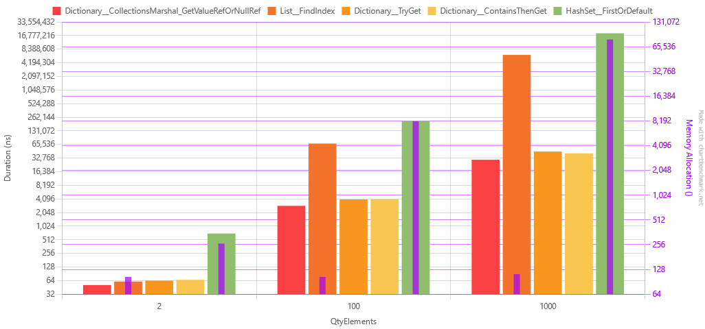

[Readme](./readme.md)

# Find one record in a Dictionary vs. List vs. HashSet and modify it
Differently from the [Find one benchmark](./findonebenchmark.md), this benchmark is about finding a record in a Dictionary, List or HashSet and modifying it.

The idea was to check the fastest way to find a record and modify it. I know that this benchmark was unfair to the HashSet, but I kept it here for science. :) 

Scenarios:
1. List__FindIndex: Find the index of the record and modify it.
2. Dictionary__TryGet: Try to get the record and modify it.
3. Dictionary__ContainsThenGet: Check if the record exists and then modify it.
4. Dictionary__CollectionsMarshal_GetValueRefOrNullRef: Use the CollectionsMarshal to get a reference to the record and modify it.
5. HashSet__FirstOrDefault: Find the record and modify it.

## Results
| Method                                              | QtyElements |             Mean |          Error |         StdDev |           Median |              Min |              Max | Rank |   Gen0 | Allocated |
|-----------------------------------------------------|-------------|-----------------:|---------------:|---------------:|-----------------:|-----------------:|-----------------:|-----:|-------:|----------:|
| Dictionary__CollectionsMarshal_GetValueRefOrNullRef | 2           |         51.03 ns |       0.975 ns |       1.707 ns |         50.51 ns |         48.92 ns |         55.19 ns |    1 |      - |         - |
| List__FindIndex                                     | 2           |         61.02 ns |       1.245 ns |       3.170 ns |         61.54 ns |         55.88 ns |         67.62 ns |    2 | 0.0166 |     104 B |
| Dictionary__TryGet                                  | 2           |         63.86 ns |       1.301 ns |       2.882 ns |         62.80 ns |         60.51 ns |         72.45 ns |    3 |      - |         - |
| Dictionary__ContainsThenGet                         | 2           |         66.75 ns |       0.934 ns |       0.730 ns |         66.45 ns |         65.66 ns |         67.97 ns |    4 |      - |         - |
| HashSet__FirstOrDefault                             | 2           |        703.97 ns |      10.300 ns |       9.635 ns |        706.16 ns |        690.11 ns |        723.89 ns |    5 | 0.0420 |     264 B |
| Dictionary__CollectionsMarshal_GetValueRefOrNullRef | 100         |      2,875.50 ns |      57.372 ns |     127.131 ns |      2,844.99 ns |      2,720.63 ns |      3,093.16 ns |    6 |      - |         - |
| Dictionary__TryGet                                  | 100         |      3,989.08 ns |      28.220 ns |      22.032 ns |      3,991.33 ns |      3,945.48 ns |      4,025.43 ns |    7 |      - |         - |
| Dictionary__ContainsThenGet                         | 100         |      4,041.61 ns |      79.198 ns |     134.485 ns |      3,974.17 ns |      3,850.20 ns |      4,329.19 ns |    7 |      - |         - |
| Dictionary__CollectionsMarshal_GetValueRefOrNullRef | 1000        |     30,095.84 ns |     255.448 ns |     213.311 ns |     30,064.94 ns |     29,790.08 ns |     30,430.62 ns |    8 |      - |         - |
| Dictionary__ContainsThenGet                         | 1000        |     41,761.05 ns |     655.583 ns |     511.836 ns |     41,708.78 ns |     41,124.30 ns |     43,138.95 ns |    9 |      - |         - |
| Dictionary__TryGet                                  | 1000        |     45,754.82 ns |     910.903 ns |   2,199.934 ns |     44,813.96 ns |     43,271.51 ns |     49,480.57 ns |   10 |      - |         - |
| List__FindIndex                                     | 100         |     68,669.75 ns |   1,365.366 ns |   3,271.329 ns |     69,870.43 ns |     62,274.71 ns |     74,949.21 ns |   11 |      - |     104 B |
| HashSet__FirstOrDefault                             | 100         |    216,010.01 ns |   4,275.681 ns |  10,568.424 ns |    217,721.44 ns |    201,395.36 ns |    237,456.64 ns |   12 | 1.2207 |    8104 B |
| List__FindIndex                                     | 1000        |  6,271,111.16 ns |  64,006.534 ns |  56,740.125 ns |  6,271,454.69 ns |  6,182,946.09 ns |  6,399,375.78 ns |   13 |      - |     112 B |
| HashSet__FirstOrDefault                             | 1000        | 18,822,612.26 ns | 222,358.336 ns | 185,679.281 ns | 18,762,509.38 ns | 18,584,684.38 ns | 19,152,321.88 ns |   14 |      - |   80134 B |

What did we learn from that?
1. List.FindIndex performance degrades very fast.
2. Dictionary performance is very good and also don't allocate memory.
3. CollectionMarshal is the fastest, but not by a lot. If you really need every single nanosecond, you can use it. (As long as you remember that it uses unsafe code.)
4. I'm feeling bad for the HashSet, but we already knew that this was going to be the result.
