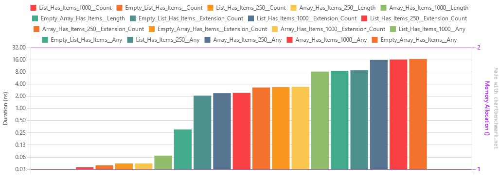
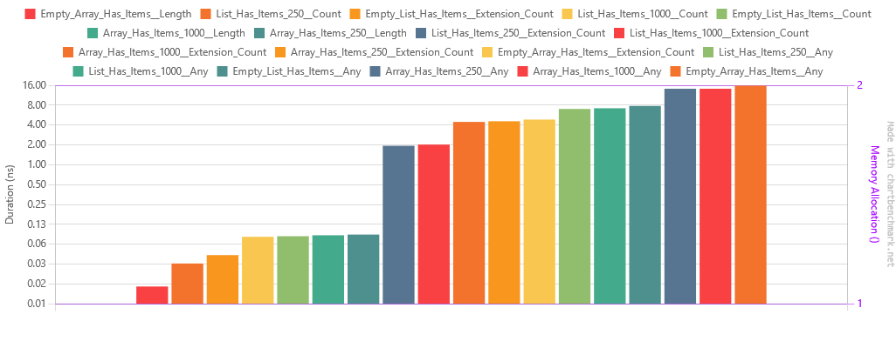

[Readme](./readme.md)


# List has items
I've been using `.Any()` has the my standard way to check if any list has items. I remember that SonarQube would even
advise using it "for readability and performance". It's been a while and it's always good to keep what we know in check.

So this benchmark aims to test which way is the fastest to check if a list has items.
I have 3 data sets:
1. An empty list/array;
2. A list/array with 250 items;
3. A list/array with 1000 items;

And I'm using 3 methods:
1. `.Any()`;
2. `.Count > 0`;
3. `.Count > 0` inside an extension method;


# Results
## .net6
``` ini

BenchmarkDotNet=v0.13.4, OS=Windows 10 (10.0.19045.3086)
Intel Core i7-9750H CPU 2.60GHz, 1 CPU, 12 logical and 6 physical cores
.NET SDK=7.0.202
  [Host]     : .NET 6.0.15 (6.0.1523.11507), X64 RyuJIT AVX2
  DefaultJob : .NET 6.0.15 (6.0.1523.11507), X64 RyuJIT AVX2


```
| Method                                 |       Mean |     Error |    StdDev |     Median |        Min |        Max | Rank | Allocated |
|----------------------------------------|-----------:|----------:|----------:|-----------:|-----------:|-----------:|-----:|----------:|
| List_Has_Items_1000__Count             |  0.0351 ns | 0.0222 ns | 0.0528 ns |  0.0000 ns |  0.0000 ns |  0.2327 ns |    1 |         - |
| Empty_List_Has_Items__Count            |  0.0392 ns | 0.0219 ns | 0.0646 ns |  0.0000 ns |  0.0000 ns |  0.2559 ns |    1 |         - |
| List_Has_Items_250__Count              |  0.0436 ns | 0.0232 ns | 0.0608 ns |  0.0000 ns |  0.0000 ns |  0.2266 ns |    1 |         - |
| Array_Has_Items_250__Length            |  0.0439 ns | 0.0232 ns | 0.0574 ns |  0.0135 ns |  0.0000 ns |  0.2076 ns |    1 |         - |
| Array_Has_Items_1000__Length           |  0.0684 ns | 0.0321 ns | 0.0782 ns |  0.0303 ns |  0.0000 ns |  0.2829 ns |    1 |         - |
| Empty_Array_Has_Items__Length          |  0.3030 ns | 0.0434 ns | 0.1167 ns |  0.2939 ns |  0.0689 ns |  0.5199 ns |    2 |         - |
| Empty_List_Has_Items__Extension_Count  |  2.0732 ns | 0.0807 ns | 0.2381 ns |  2.1215 ns |  1.5494 ns |  2.5143 ns |    3 |         - |
| List_Has_Items_1000__Extension_Count   |  2.3831 ns | 0.0839 ns | 0.2166 ns |  2.3849 ns |  1.8708 ns |  2.8170 ns |    4 |         - |
| List_Has_Items_250__Extension_Count    |  2.4304 ns | 0.0847 ns | 0.2304 ns |  2.4753 ns |  1.8499 ns |  2.9520 ns |    4 |         - |
| Array_Has_Items_250__Extension_Count   |  3.2917 ns | 0.1135 ns | 0.3347 ns |  3.2629 ns |  2.6786 ns |  3.9718 ns |    5 |         - |
| Empty_Array_Has_Items__Extension_Count |  3.3409 ns | 0.1029 ns | 0.2765 ns |  3.3121 ns |  2.7875 ns |  3.8866 ns |    5 |         - |
| Array_Has_Items_1000__Extension_Count  |  3.4253 ns | 0.1047 ns | 0.2919 ns |  3.4175 ns |  2.8105 ns |  4.1098 ns |    5 |         - |
| List_Has_Items_1000__Any               |  8.1411 ns | 0.1999 ns | 0.5895 ns |  8.2005 ns |  6.7179 ns |  9.4077 ns |    6 |         - |
| Empty_List_Has_Items__Any              |  8.4814 ns | 0.2190 ns | 0.6456 ns |  8.3960 ns |  7.0442 ns |  9.8219 ns |    7 |         - |
| List_Has_Items_250__Any                |  8.7899 ns | 0.2694 ns | 0.7943 ns |  8.7069 ns |  7.1204 ns | 10.6530 ns |    8 |         - |
| Array_Has_Items_250__Any               | 15.8574 ns | 0.4050 ns | 1.1941 ns | 15.8024 ns | 13.5137 ns | 18.1305 ns |    9 |         - |
| Array_Has_Items_1000__Any              | 16.1936 ns | 0.3598 ns | 1.0608 ns | 16.0354 ns | 14.0837 ns | 18.4173 ns |    9 |         - |
| Empty_Array_Has_Items__Any             | 16.7453 ns | 0.3712 ns | 1.0470 ns | 16.7439 ns | 14.1796 ns | 18.9942 ns |   10 |         - |




## .net8
``` ini

BenchmarkDotNet=v0.13.4, OS=Windows 10 (10.0.19045.3086)
Intel Core i7-9750H CPU 2.60GHz, 1 CPU, 12 logical and 6 physical cores
.NET SDK=8.0.100-preview.4.23260.5
  [Host]     : .NET 8.0.0 (8.0.23.25905), X64 RyuJIT AVX2
  DefaultJob : .NET 8.0.0 (8.0.23.25905), X64 RyuJIT AVX2


```
| Method                                 |       Mean |     Error |    StdDev |     Median |        Min |        Max | Rank | Allocated |
|----------------------------------------|-----------:|----------:|----------:|-----------:|-----------:|-----------:|-----:|----------:|
| Empty_Array_Has_Items__Length          |  0.0143 ns | 0.0155 ns | 0.0319 ns |  0.0000 ns |  0.0000 ns |  0.1678 ns |    1 |         - |
| List_Has_Items_250__Count              |  0.0319 ns | 0.0201 ns | 0.0442 ns |  0.0148 ns |  0.0000 ns |  0.1559 ns |    1 |         - |
| Empty_List_Has_Items__Extension_Count  |  0.0427 ns | 0.0225 ns | 0.0517 ns |  0.0166 ns |  0.0000 ns |  0.1757 ns |    1 |         - |
| List_Has_Items_1000__Count             |  0.0810 ns | 0.0290 ns | 0.0814 ns |  0.0717 ns |  0.0000 ns |  0.3069 ns |    1 |         - |
| Empty_List_Has_Items__Count            |  0.0826 ns | 0.0325 ns | 0.0863 ns |  0.0610 ns |  0.0000 ns |  0.3187 ns |    1 |         - |
| Array_Has_Items_1000__Length           |  0.0853 ns | 0.0320 ns | 0.0901 ns |  0.0549 ns |  0.0000 ns |  0.3425 ns |    1 |         - |
| Array_Has_Items_250__Length            |  0.0875 ns | 0.0341 ns | 0.0735 ns |  0.0809 ns |  0.0000 ns |  0.2595 ns |    1 |         - |
| List_Has_Items_250__Extension_Count    |  1.9376 ns | 0.0772 ns | 0.1951 ns |  1.9431 ns |  1.5429 ns |  2.4052 ns |    2 |         - |
| List_Has_Items_1000__Extension_Count   |  2.0194 ns | 0.0764 ns | 0.2013 ns |  2.0286 ns |  1.5410 ns |  2.3730 ns |    3 |         - |
| Array_Has_Items_1000__Extension_Count  |  4.4592 ns | 0.1289 ns | 0.2829 ns |  4.4447 ns |  3.7385 ns |  5.0364 ns |    4 |         - |
| Array_Has_Items_250__Extension_Count   |  4.5627 ns | 0.1307 ns | 0.3772 ns |  4.5213 ns |  3.8018 ns |  5.3120 ns |    4 |         - |
| Empty_Array_Has_Items__Extension_Count |  4.8327 ns | 0.1399 ns | 0.2762 ns |  4.8675 ns |  4.0884 ns |  5.3484 ns |    5 |         - |
| List_Has_Items_250__Any                |  7.0025 ns | 0.1734 ns | 0.4317 ns |  7.0210 ns |  5.9392 ns |  7.9018 ns |    6 |         - |
| List_Has_Items_1000__Any               |  7.1794 ns | 0.1817 ns | 0.5243 ns |  7.1697 ns |  6.1109 ns |  8.3424 ns |    6 |         - |
| Empty_List_Has_Items__Any              |  7.7893 ns | 0.2083 ns | 0.6142 ns |  7.7098 ns |  6.4461 ns |  9.0390 ns |    7 |         - |
| Array_Has_Items_250__Any               | 14.1725 ns | 0.3062 ns | 0.8637 ns | 14.0650 ns | 12.1943 ns | 16.2712 ns |    8 |         - |
| Array_Has_Items_1000__Any              | 14.1862 ns | 0.3232 ns | 0.9273 ns | 14.0851 ns | 12.3750 ns | 16.1514 ns |    8 |         - |
| Empty_Array_Has_Items__Any             | 15.7752 ns | 0.3561 ns | 0.8323 ns | 15.8250 ns | 14.0295 ns | 17.7869 ns |    9 |         - |




# Results
So, across the board, for both .net6 and .net8, using the `Count` property is the fastest way to check if a list has 
items.  The `Any` method is the slowest, especially if applied to an array. 

TBH, I like the readability that `.Any()` provides, so I could switch to an extension method that does the `.count > 0`
internally. This way I have a better performance and (IMO) more readable syntax. Even tough it adds an overhead and we 
lose a bit of performance, but I think it's worth it. Keep in mind that this is my opinion, you should follow the style 
guide of your team or company. :)

Another thing to consider is that even though the difference is big, we are talking about nanoseconds here.


# Why this difference?
The difference between the two is rooted in their implementations and the scenarios where they are the most effective.

1. `List<T>.Count`: This property returns the number of elements contained in the `List<T>`. This is a very efficient 
operation because `List<T>` maintains an internal counter of its elements, so it's just accessing a precalculated 
property. After it gets the count, it checks if it's greater than zero.

2. `Enumerable.Any()`: This is a LINQ extension method provided by .NET. This method returns `true` if the source 
sequence contains any elements; otherwise, `false`. The `Any()` method works by using an enumerator on the 
collection and trying to move to the first element. If it can move to the first element, it returns `true`; 
otherwise, it returns `false`. It doesn't need to iterate through the entire collection.
