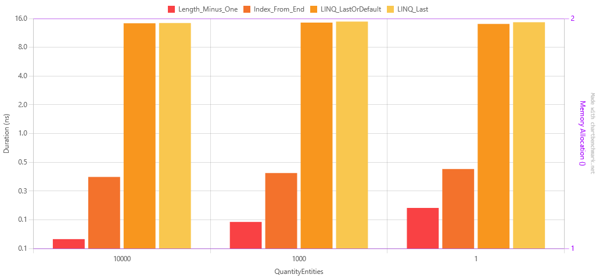

[Readme](./readme.md)

# List Operations - Find Last
Out of curiosity, I decided to see which method is the fastest to find the last element in a list. 
I created 3 workloads: 1 list containing 1 lement, another with 1000 and the last one with 10,000 elements and then ran the 
following methods to find the last element in the list:

1. Length_Minus_One: The classic. (Actually, count -1, because it was a list and not an array)
2. Index_From_End: Using the index from end syntax. 
3. LINQ_LastOrDefault: Linq's LastOrDefault method.
4. LINQ_Last: Linq's Last method.

# Results 
| Method             | QuantityEntities |       Mean |     Error |    StdDev |        Min |        Max |     Median | Rank | Allocated |
|--------------------|------------------|-----------:|----------:|----------:|-----------:|-----------:|-----------:|-----:|----------:|
| Length_Minus_One   | 10000            |  0.0785 ns | 0.0335 ns | 0.0447 ns |  0.0000 ns |  0.1910 ns |  0.0759 ns |    1 |         - |
| Length_Minus_One   | 1000             |  0.1189 ns | 0.0335 ns | 0.0676 ns |  0.0000 ns |  0.2609 ns |  0.1168 ns |    2 |         - |
| Length_Minus_One   | 1                |  0.1666 ns | 0.0343 ns | 0.0677 ns |  0.0090 ns |  0.3087 ns |  0.1623 ns |    3 |         - |
| Index_From_End     | 10000            |  0.3516 ns | 0.0391 ns | 0.1065 ns |  0.1696 ns |  0.6189 ns |  0.3296 ns |    4 |         - |
| Index_From_End     | 1000             |  0.3862 ns | 0.0387 ns | 0.0985 ns |  0.2128 ns |  0.6300 ns |  0.3675 ns |    5 |         - |
| Index_From_End     | 1                |  0.4257 ns | 0.0400 ns | 0.1166 ns |  0.2036 ns |  0.6909 ns |  0.4113 ns |    6 |         - |
| LINQ_LastOrDefault | 1                | 14.0568 ns | 0.3079 ns | 0.3782 ns | 13.2595 ns | 14.5825 ns | 14.1433 ns |    7 |         - |
| LINQ_LastOrDefault | 10000            | 14.2760 ns | 0.3144 ns | 0.5981 ns | 12.9824 ns | 15.6408 ns | 14.2959 ns |    7 |         - |
| LINQ_Last          | 10000            | 14.3652 ns | 0.3164 ns | 0.7879 ns | 12.8742 ns | 16.4700 ns | 14.3699 ns |    7 |         - |
| LINQ_LastOrDefault | 1000             | 14.5207 ns | 0.3203 ns | 0.7360 ns | 13.3682 ns | 16.5118 ns | 14.4080 ns |    7 |         - |
| LINQ_Last          | 1                | 14.6378 ns | 0.3148 ns | 0.5989 ns | 13.1661 ns | 15.7691 ns | 14.6208 ns |    7 |         - |
| LINQ_Last          | 1000             | 14.8698 ns | 0.3280 ns | 0.8583 ns | 13.0903 ns | 16.8419 ns | 14.6868 ns |    7 |         - |

So, sometimes, the old ways are better. Simply using count -1 was the fastest for all workloads. As always, linq adds some overhead, 
but it's not that bad (and IMO is the most readable, which is a great plus).