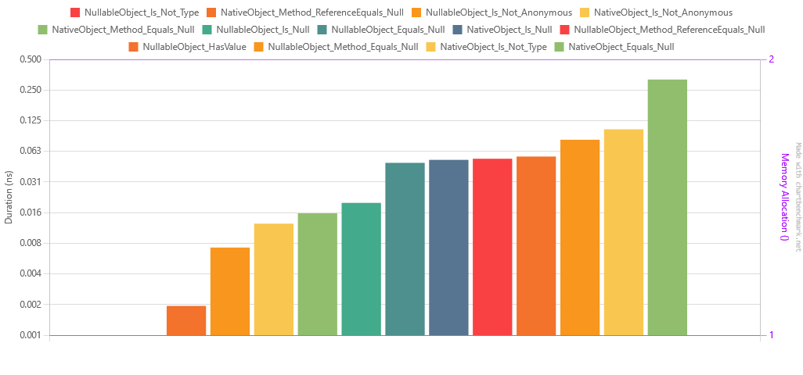

[Readme](./readme.md)


# Null comparison benchmark
C# offers so many ways to check for null, so I decided to see which one is the fastest. I used BenchmarkDotNet to test it. The results are below.

Every scenario listed bellow was tested for a class that inherits from object and a class that inherits from ValueType and implements Nullable.

- Object is not {}
- Object is not <Type>
- Object == null
- Object.Equals(null)
- Object.ReferenceEquals(null)
- Object.HasValue (this one is only for Nullable<T>)

## Differences between object.ReferenceEquals and object.Equals
`object.ReferenceEquals` method checks if two object references refer to the same instance. It returns `true` if both objects refer to 
the same instance, otherwise it returns `false`. The method compares the memory addresses of the objects to determine if they refer 
to the same instance. It is typically used to check if two object references are the same instance.
```csharp
object a = new object();
object b = a;
bool areEqual = object.ReferenceEquals(a, b); // True
```

`object.Equals` method checks if two objects are equal in value. It returns `true` if the values of the objects are equal, and 
`false` otherwise. The default implementation of `object.Equals` compares object references to see if they refer to the same instance, 
but this can be overridden in a derived class to provide a different implementation that compares the values of the objects.

```csharp
object a = new object();
object b = new object();
bool areEqual = object.Equals(a, b); // False
```


# Results

| Method                                     |      Mean |     Error |    StdDev |    Median |       Min |       Max | Rank | Allocated |
|--------------------------------------------|----------:|----------:|----------:|----------:|----------:|----------:|-----:|----------:|
| NullableObject_Is_Not_Type                 | 0.0000 ns | 0.0000 ns | 0.0000 ns | 0.0000 ns | 0.0000 ns | 0.0000 ns |    1 |         - |
| NativeObject_Method_ReferenceEquals_Null   | 0.0019 ns | 0.0049 ns | 0.0044 ns | 0.0000 ns | 0.0000 ns | 0.0153 ns |    1 |         - |
| NullableObject_Is_Not_Anonymous            | 0.0071 ns | 0.0117 ns | 0.0125 ns | 0.0000 ns | 0.0000 ns | 0.0359 ns |    1 |         - |
| NativeObject_Is_Not_Anonymous              | 0.0122 ns | 0.0102 ns | 0.0296 ns | 0.0000 ns | 0.0000 ns | 0.1225 ns |    1 |         - |
| NativeObject_Method_Equals_Null            | 0.0154 ns | 0.0231 ns | 0.0193 ns | 0.0122 ns | 0.0000 ns | 0.0661 ns |    1 |         - |
| NullableObject_Is_Null                     | 0.0195 ns | 0.0186 ns | 0.0289 ns | 0.0000 ns | 0.0000 ns | 0.1082 ns |    1 |         - |
| NullableObject_Equals_Null                 | 0.0482 ns | 0.0224 ns | 0.0602 ns | 0.0301 ns | 0.0000 ns | 0.2544 ns |    1 |         - |
| NativeObject_Is_Null                       | 0.0516 ns | 0.0308 ns | 0.0479 ns | 0.0453 ns | 0.0000 ns | 0.1608 ns |    1 |         - |
| NullableObject_Method_ReferenceEquals_Null | 0.0529 ns | 0.0298 ns | 0.0566 ns | 0.0290 ns | 0.0000 ns | 0.2125 ns |    1 |         - |
| NullableObject_HasValue                    | 0.0556 ns | 0.0263 ns | 0.0620 ns | 0.0378 ns | 0.0000 ns | 0.2165 ns |    1 |         - |
| NullableObject_Method_Equals_Null          | 0.0813 ns | 0.0319 ns | 0.0506 ns | 0.0798 ns | 0.0000 ns | 0.1811 ns |    2 |         - |
| NativeObject_Is_Not_Type                   | 0.1030 ns | 0.0316 ns | 0.0925 ns | 0.0795 ns | 0.0000 ns | 0.3199 ns |    2 |         - |
| NativeObject_Equals_Null                   | 0.3171 ns | 0.0356 ns | 0.0867 ns | 0.2926 ns | 0.2051 ns | 0.5237 ns |    3 |         - |




Interesting results here. For a ValueType object, checking if the object `is not type` is way faster than using the `HasValue` method.
For an reference object, using object.ReferenceEquals is the fastest way to check if the object is null, but (IMO) I don't really like the readability.

At least for me, the unexpected result was the `object == null` being so slow.

Does this means I'll go berserk and change all null checks in my applications? Not really. Unless I'm really after every single millisecond, 
I'll stick with the `object == null` syntax. It's just easier to read and understand, especially for new developers.