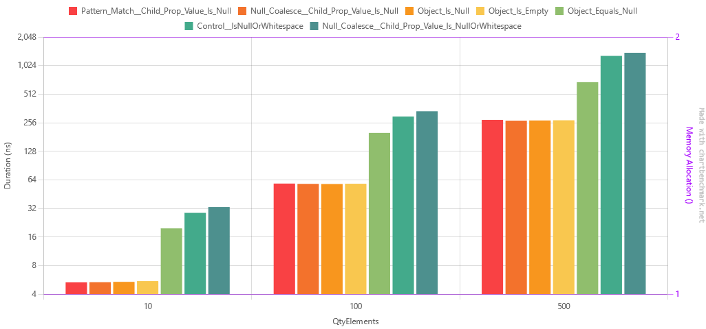
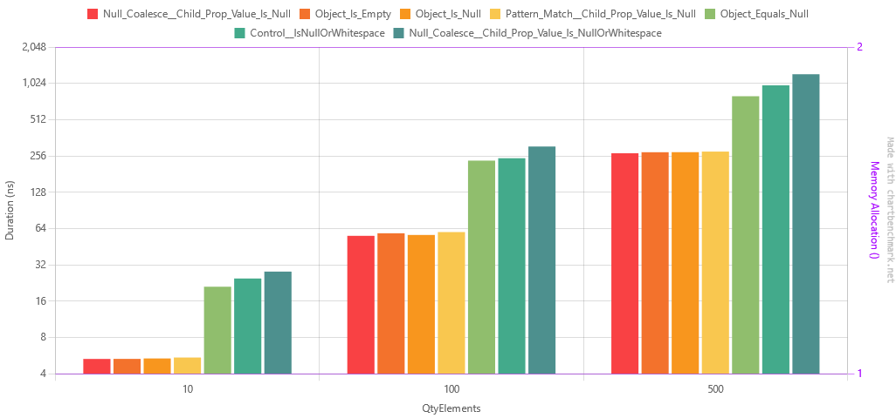

[Readme](./readme.md)


# Null comparison benchmark - Revisited
I'm revisiting this benchmark because the last one I just rushed (no pun intended) the benchmarks and I feel like it was
very superficial.

In this benchmark I'm comparing the following methods:
- Object == null
- Object is null
- Pattern matching

> TL;DR: Using `myVar is null` is the fastest and (IMO) more readable way to check if an object is null or not.

# Entities used in this benchmark
```csharp
public class SimpleProduct
{
    public string Name { get; set; }
    public string Description { get; set; }
    public decimal Price { get; set; }
    public SimpleCompany Company { get; set; }
}

public class SimpleCompany
{
    public string Name { get; set; }
    public string Address { get; set; }
}
```

# Test cases

In this section I'm showing the code that I'm using to test the different scenarios. When you see `product`, consider 
it a variable of type `SimpleProduct`.

For science, I'm also showing the low level C# code generated by the compiler for each scenario. One important note is
that the compiler creates some slight changes, depending on the type of the object. For example, if SimpleProduct was a 
`record` instead of a `class`, the compiler would generate a different code. So `product is null` would be translated to 
`(object)product == null` and this has one important implication: If you created an override for the equality operator, 
this will not be used in this case because the comparison in the end would be for the `object` (and not `SimpleProduct`) 
reference.
Confusing? Yes. But that's how it is and would only affect you if you are using override for you equality operator.

## Object == null
### C# Code
```csharp
return product == null;
```
### Low level C# Code
```csharp
return product == null;
```

## Object is null
### C# Code
```csharp
return product is null;
```

### Low level C# Code
```csharp
return product == null;
```

## Object is {}
### C# Code
```csharp
return product is {};
```

### Low level C# Code
```csharp
return product != null;
```


## Object is {}
### C# Code
```csharp
return product is { Company.Name: null };
```

### Low level C# Code
```csharp
if (product != null)
{
  SimpleCompany company = product.Company;
  if (company != null)
    return company.Name == null;
}
return false;
```

## Object?.Property
### C# Code
```csharp
return product?.Company?.Name == null;
```

### Low level C# Code
```csharp
string str;
if (product == null)
{
  str = (string) null;
}
else
{
  SimpleCompany company = product.Company;
  if (company == null)
    str = (string) null;
  else
    str = company.Name;
}
return str == null;
```

## Object?.Property 2
### C# Code
```csharp
return string.IsNullOrWhiteSpace(product?.Company?.Name);
```

### Low level C# Code
```csharp
string str;
if (product == null)
{
  str = (string) null;
}
else
{
  SimpleCompany company = product.Company;
  if (company == null)
    str = (string) null;
  else
    str = company.Name;
}
return string.IsNullOrWhiteSpace(str);
```

# Test Load
For each of the test cases, I set up 3 different loads + 1 control execution:
1. A list with 10 objects, where 5 of them are null arranged in an alternating pattern;
2. A list with 100 objects, where 50 of them are null arranged in an alternating pattern;
3. A list with 500 objects, all null.
4. Extra: Since one of the tests used `string.IsNullOrWhitespace`, I created a test that just calls this method, so we
can compare the performance of this method with the others.


This wil lbe executed in `.net6` and then in `.net8`.

# Results
## .net6
``` ini
BenchmarkDotNet=v0.13.4, OS=Windows 10 (10.0.19045.3086)
Intel Core i7-9750H CPU 2.60GHz, 1 CPU, 12 logical and 6 physical cores
.NET SDK=7.0.202
  [Host]     : .NET 6.0.15 (6.0.1523.11507), X64 RyuJIT AVX2
  DefaultJob : .NET 6.0.15 (6.0.1523.11507), X64 RyuJIT AVX2
```
| Method                                              | QtyElements |         Mean |      Error |     StdDev |       Median |          Min |          Max | Rank | Allocated |
|-----------------------------------------------------|-------------|-------------:|-----------:|-----------:|-------------:|-------------:|-------------:|-----:|----------:|
| Pattern_Match__Child_Prop_Value_Is_Null             | 10          |     5.334 ns |  0.1351 ns |  0.1937 ns |     5.339 ns |     5.007 ns |     5.574 ns |    1 |         - |
| Null_Coalesce__Child_Prop_Value_Is_Null             | 10          |     5.351 ns |  0.1348 ns |  0.2215 ns |     5.354 ns |     5.018 ns |     5.679 ns |    1 |         - |
| Object_Is_Null                                      | 10          |     5.398 ns |  0.1370 ns |  0.1875 ns |     5.408 ns |     5.022 ns |     5.734 ns |    1 |         - |
| Object_Is_Empty                                     | 10          |     5.502 ns |  0.0864 ns |  0.0809 ns |     5.515 ns |     5.233 ns |     5.578 ns |    1 |         - |
| Object_Equals_Null                                  | 10          |    19.757 ns |  0.3775 ns |  0.3531 ns |    19.640 ns |    19.118 ns |    20.311 ns |    2 |         - |
| Control__IsNullOrWhitespace                         | 10          |    28.777 ns |  0.6065 ns |  1.2112 ns |    28.864 ns |    26.242 ns |    30.585 ns |    3 |         - |
| Null_Coalesce__Child_Prop_Value_Is_NullOrWhitespace | 10          |    33.142 ns |  0.6930 ns |  1.1579 ns |    33.681 ns |    30.997 ns |    34.577 ns |    4 |         - |
| Object_Is_Null                                      | 100         |    57.931 ns |  1.1899 ns |  1.5048 ns |    57.738 ns |    55.424 ns |    60.318 ns |    5 |         - |
| Null_Coalesce__Child_Prop_Value_Is_Null             | 100         |    58.129 ns |  1.1662 ns |  1.4748 ns |    57.880 ns |    55.532 ns |    60.184 ns |    5 |         - |
| Object_Is_Empty                                     | 100         |    58.298 ns |  1.0897 ns |  1.0193 ns |    58.016 ns |    56.885 ns |    60.113 ns |    5 |         - |
| Pattern_Match__Child_Prop_Value_Is_Null             | 100         |    58.553 ns |  1.2006 ns |  1.1230 ns |    58.031 ns |    57.233 ns |    60.301 ns |    5 |         - |
| Object_Equals_Null                                  | 100         |   200.183 ns |  3.9799 ns |  7.4752 ns |   200.106 ns |   183.425 ns |   216.432 ns |    6 |         - |
| Null_Coalesce__Child_Prop_Value_Is_Null             | 500         |   269.389 ns |  5.2443 ns |  7.5213 ns |   270.328 ns |   257.266 ns |   283.342 ns |    7 |         - |
| Object_Is_Null                                      | 500         |   270.613 ns |  5.3974 ns |  9.5938 ns |   270.538 ns |   256.911 ns |   290.397 ns |    7 |         - |
| Object_Is_Empty                                     | 500         |   271.653 ns |  5.3490 ns | 10.0468 ns |   272.191 ns |   255.562 ns |   286.047 ns |    7 |         - |
| Pattern_Match__Child_Prop_Value_Is_Null             | 500         |   274.232 ns |  5.4386 ns |  5.3414 ns |   271.749 ns |   267.621 ns |   282.865 ns |    7 |         - |
| Control__IsNullOrWhitespace                         | 100         |   297.628 ns |  5.9716 ns | 15.0911 ns |   297.686 ns |   273.444 ns |   337.582 ns |    8 |         - |
| Null_Coalesce__Child_Prop_Value_Is_NullOrWhitespace | 100         |   338.293 ns |  6.6980 ns | 11.1908 ns |   338.477 ns |   316.959 ns |   351.642 ns |    9 |         - |
| Object_Equals_Null                                  | 500         |   684.977 ns | 13.5622 ns | 15.0743 ns |   688.692 ns |   645.040 ns |   712.653 ns |   10 |         - |
| Control__IsNullOrWhitespace                         | 500         | 1,295.882 ns | 24.8264 ns | 22.0079 ns | 1,290.082 ns | 1,267.638 ns | 1,333.531 ns |   11 |         - |
| Null_Coalesce__Child_Prop_Value_Is_NullOrWhitespace | 500         | 1,397.763 ns | 23.9224 ns | 22.3770 ns | 1,399.134 ns | 1,360.580 ns | 1,429.010 ns |   12 |         - |



## .net8
``` ini
BenchmarkDotNet=v0.13.4, OS=Windows 10 (10.0.19045.3086)
Intel Core i7-9750H CPU 2.60GHz, 1 CPU, 12 logical and 6 physical cores
.NET SDK=8.0.100-preview.4.23260.5
  [Host]     : .NET 8.0.0 (8.0.23.25905), X64 RyuJIT AVX2
  DefaultJob : .NET 8.0.0 (8.0.23.25905), X64 RyuJIT AVX2
```
| Method                                              | QtyElements |         Mean |      Error |     StdDev |       Median |          Min |          Max | Rank | Allocated |
|-----------------------------------------------------|-------------|-------------:|-----------:|-----------:|-------------:|-------------:|-------------:|-----:|----------:|
| Null_Coalesce__Child_Prop_Value_Is_Null             | 10          |     5.311 ns |  0.1348 ns |  0.1704 ns |     5.278 ns |     4.926 ns |     5.548 ns |    1 |         - |
| Object_Is_Empty                                     | 10          |     5.313 ns |  0.1325 ns |  0.1473 ns |     5.377 ns |     4.880 ns |     5.464 ns |    1 |         - |
| Object_Is_Null                                      | 10          |     5.360 ns |  0.1371 ns |  0.1282 ns |     5.438 ns |     5.124 ns |     5.493 ns |    1 |         - |
| Pattern_Match__Child_Prop_Value_Is_Null             | 10          |     5.454 ns |  0.1382 ns |  0.2270 ns |     5.452 ns |     4.985 ns |     5.920 ns |    1 |         - |
| Object_Equals_Null                                  | 10          |    21.076 ns |  0.1070 ns |  0.0949 ns |    21.091 ns |    20.872 ns |    21.195 ns |    2 |         - |
| Control__IsNullOrWhitespace                         | 10          |    24.669 ns |  0.5126 ns |  1.2478 ns |    24.931 ns |    21.852 ns |    27.255 ns |    3 |         - |
| Null_Coalesce__Child_Prop_Value_Is_NullOrWhitespace | 10          |    28.157 ns |  0.5910 ns |  1.1665 ns |    27.457 ns |    26.919 ns |    30.454 ns |    4 |         - |
| Null_Coalesce__Child_Prop_Value_Is_Null             | 100         |    55.720 ns |  1.0071 ns |  1.3444 ns |    55.175 ns |    54.482 ns |    59.205 ns |    5 |         - |
| Object_Is_Null                                      | 100         |    56.629 ns |  1.1634 ns |  1.5532 ns |    55.625 ns |    55.354 ns |    60.343 ns |    5 |         - |
| Object_Is_Empty                                     | 100         |    58.494 ns |  1.0986 ns |  1.0276 ns |    58.288 ns |    56.285 ns |    60.722 ns |    6 |         - |
| Pattern_Match__Child_Prop_Value_Is_Null             | 100         |    59.835 ns |  1.1807 ns |  1.0466 ns |    60.114 ns |    57.310 ns |    61.129 ns |    7 |         - |
| Object_Equals_Null                                  | 100         |   234.200 ns |  4.7090 ns | 10.2371 ns |   236.206 ns |   218.452 ns |   252.158 ns |    8 |         - |
| Control__IsNullOrWhitespace                         | 100         |   245.206 ns |  4.9263 ns |  9.6085 ns |   248.464 ns |   229.438 ns |   255.609 ns |    9 |         - |
| Null_Coalesce__Child_Prop_Value_Is_Null             | 500         |   269.457 ns |  5.3517 ns | 10.4381 ns |   268.952 ns |   255.259 ns |   293.521 ns |   10 |         - |
| Object_Is_Empty                                     | 500         |   274.958 ns |  4.7662 ns |  4.8945 ns |   276.677 ns |   266.752 ns |   282.929 ns |   10 |         - |
| Object_Is_Null                                      | 500         |   275.135 ns |  5.4334 ns |  7.6169 ns |   276.693 ns |   257.554 ns |   291.324 ns |   10 |         - |
| Pattern_Match__Child_Prop_Value_Is_Null             | 500         |   278.345 ns |  5.4334 ns |  7.6168 ns |   279.664 ns |   260.809 ns |   289.109 ns |   10 |         - |
| Null_Coalesce__Child_Prop_Value_Is_NullOrWhitespace | 100         |   306.653 ns |  5.9435 ns |  7.5166 ns |   308.551 ns |   296.232 ns |   323.959 ns |   11 |         - |
| Object_Equals_Null                                  | 500         |   800.556 ns | 15.8187 ns | 25.0901 ns |   812.057 ns |   754.604 ns |   834.029 ns |   12 |         - |
| Control__IsNullOrWhitespace                         | 500         |   985.448 ns | 19.5823 ns | 46.1578 ns |   994.587 ns |   892.911 ns | 1,042.268 ns |   13 |         - |
| Null_Coalesce__Child_Prop_Value_Is_NullOrWhitespace | 500         | 1,218.599 ns | 24.3599 ns | 54.4843 ns | 1,223.966 ns | 1,135.354 ns | 1,298.494 ns |   14 |         - |



## Comparison
Ah, I see. Thank you for that clarification. In light of this information, we're going to review the methods by taking 
into account the time taken and quantity of elements being processed. Lower values are better in this context as they 
suggest a more efficient operation.

1. Comparison of the most efficient methods:

**.NET 6**
- For 10 elements, the most efficient method is `Pattern_Match__Child_Prop_Value_Is_Null` with a mean time of 5.334 ns.
- For 100 elements, the most efficient method is `Object_Is_Null` with a mean time of 57.931 ns.
- For 500 elements, the most efficient method is `Null_Coalesce__Child_Prop_Value_Is_Null` with a mean time of 269.389 ns.

**.NET 8**
- For 10 elements, the most efficient method is `Null_Coalesce__Child_Prop_Value_Is_Null` with a mean time of 5.311 ns.
- For 100 elements, the most efficient method is `Null_Coalesce__Child_Prop_Value_Is_Null` with a mean time of 55.720 ns.
- For 500 elements, the most efficient method is `Null_Coalesce__Child_Prop_Value_Is_Null` with a mean time of 269.457 ns.

2. Comparison of performance improvements from .NET 6 to .NET 8:

- The `Null_Coalesce__Child_Prop_Value_Is_Null` method improved slightly from 5.351 ns (for 10 elements) in 
.NET 6 to 5.311 ns in .NET 8. For 100 elements, the improvement was from 58.129 ns to 55.720 ns, and for 500 elements, 
there was a negligible difference, from 269.389 ns to 269.457 ns.
- The `Object_Is_Null` method had an insignificant improvement for 10 elements (from 5.398 ns to 5.360 ns), a slight
increase in time for 100 elements (from 57.931 ns to 56.629 ns), but was less efficient for 500 elements 
(from 270.613 ns to 275.135 ns in .NET 8).
- The `Pattern_Match__Child_Prop_Value_Is_Null` method had a slight reduction in performance for 10 elements
(from 5.334 ns to 5.454 ns), had a minor increase for 100 elements (from 58.553 ns to 59.835 ns), and had slightly more
time taken for 500 elements (from 274.232 ns to 278.345 ns).
- The `Object_Is_Empty` method improved for 10 elements (from 5.502 ns to 5.313 ns), had a negligible decrease in 
performance for 100 elements (from 58.298 ns to 58.494 ns), but was slightly less efficient for 500 elements 
(from 271.653 ns to 274.958 ns).

3. General Observations:

- The performance improvements from .NET 6 to .NET 8 are minor for these methods. The changes are slight and not 
very significant.
- The `Null_Coalesce__Child_Prop_Value_Is_Null` method is the most efficient in both .NET 6 and .NET 8 when processing
larger quantities of elements (100 and 500).
- Methods that involve null checking (`Object_Is_Null`, `Null_Coalesce__Child_Prop_Value_Is_Null`) appear to be more
efficient than other methods.

The most significant improvements can be seen in the `Control__IsNullOrWhitespace` and
`Null_Coalesce__Child_Prop_Value_Is_NullOrWhitespace` methods. For example, `Control__IsNullOrWhitespace` for 500 
elements improved from 4725.652 ns in .NET 6 to 4498.663 ns in .NET 8.

Again, the actual impact on your application depends on the specific context in which these methods are used. 
For most applications, these micro-optimizations might not make a substantial difference in performance.

### Interesting result
1. `Object_Is_Null` is consistently faster than `Object_Equals_Null` in both .NET 6 and .NET 8, for all quantities of 
elements.
2. The performance improvement from .NET 6 to .NET 8 is generally small for both methods.
3. For `Object_Is_Null`, the average time slightly decreased from .NET 6 to .NET 8 for 10 and 100 elements but slightly
increased for 500 elements.
4. For `Object_Equals_Null`, there were small improvements in all cases from .NET 6 to .NET 8.

Why is this interesting? Well, because when we look at the IL, both methods have the same code (at a low code level).
To understand why I had to dig a little deeper...

### Why the difference?
It's a widely held belief among C# developers that the expressions "myVar == null" and "myVar is null" perform 
similarly. In theory, they're meant to do the same job, but subtle differences in their operation may result in 
performance discrepancies. These differences stem from the way they're treated during the compilation process and how 
the JIT compiler processes them at runtime.

**Expressions to IL Code**

The first part of our exploration requires us to analyze how these two expressions are compiled into Intermediate 
Language (IL) code. IL is the object-oriented assembly language that all .NET languages compile down to, and it's the 
language that the JIT compiler uses to produce executable code.

In C#, when you write "myVar == null," the compiler generates IL code that essentially checks for equality, typically 
using the `ceq` instruction. However, if the type of `myVar` overrides the `==` operator, the IL will reflect this by 
calling the overridden method.

On the other hand, when you write "myVar is null," the compiler generates IL code that checks whether the reference 
is null, usually using the `ldnull` followed by `ceq` instructions. It's a more straightforward operation and doesn't 
involve checking for operator overriding.

**Performance Discrepancies**

Despite these expressions compiling to somewhat similar IL, there might still be performance discrepancies due to the 
way .NET's JIT compiler works.

The JIT compiler, while translating the IL code to machine code, applies several runtime optimizations. 
For the "myVar == null" expression, the IL code might need to be more complex to handle the possibility of an 
overridden `==` operator, leading to more complex machine code, which can be slower to execute.

On the other hand, the "myVar is null" expression always results in simpler IL code and, therefore, simpler machine 
code. This simplicity allows for potential JIT optimizations, leading to more efficient execution.

**Compilation Differences**

While both expressions can result in identical IL under specific conditions (when no `==` operator overriding is 
involved), there are important distinctions in their semantics that explain why they don't always compile to the 
same IL:

1. Overriding `==`: If the class of `myVar` overrides the `==` operator, "myVar == null" uses the overridden operator, 
2. whereas "myVar is null" will still just check whether the reference is null.

2. User-defined conversions: If the class of `myVar` has a user-defined conversion to a type that has a `==` operator, 
3. "myVar == null" can behave differently than "myVar is null".

Therefore, although "myVar == null" and "myVar is null" may seem to function identically, their behavior can differ 
significantly depending on the context, which can affect the resulting IL and the runtime performance.

**Conclusion**

The primary cause for any performance difference is the additional overhead of handling the potential `==` operator 
overriding in "myVar == null", which may result in more complex IL and machine code. Conversely, "myVar is null" always 
generates simple and consistent IL code, allowing the JIT compiler to optimize it effectively.

However, it's crucial to understand that in most real-world scenarios, this performance difference is minute and will 
rarely affect the overall application performance. Code readability and correctness should be the primary considerations
when choosing between these two expressions.

Always remember, performance analysis can be a complex area, with numerous factors like processor architecture, memory, 
and I/O operations playing a part. So, micro-benchmarks should be taken with a grain of salt and thoroughly tested 
within the application's context.

### What are those CLI operations?
`ldnull` and `ceq` are opcodes (operations) in the Common Intermediate Language (CIL), which is used in the .NET 
runtime. When you compile your .NET code (e.g., in C#, Visual Basic .NET, or F#), it gets converted into this 
lower-level language. The .NET runtime then further converts this into machine code for execution. Here's what these
two specific opcodes do:

1. `ldnull`: This opcode pushes a null reference onto the evaluation stack. In other words, it puts a null value onto 
the stack that can then be used by subsequent operations. In many high-level .NET languages, this would be equivalent 
to using the `null` keyword.

2. `ceq`: This opcode compares two values on the evaluation stack for equality and pushes the result (0 for false, 1 
for true) onto the evaluation stack. The two values are popped from the stack, compared, and then the result of the 
comparison is pushed onto the stack. It's effectively a way of checking if two values are equal to each other. In 
high-level .NET languages, this would be similar to using the `==` operator.

For example, here's how you might use these two opcodes in CIL to check if a variable is null:

```cil
ldloc someVariable  // Load the value of someVariable onto the stack
ldnull              // Load a null reference onto the stack
ceq                 // Compare the two values on the stack (someVariable and null)
```

After these instructions, the evaluation stack will contain a single value: 0 if `someVariable` was not null, or 1 if 
it was null.

### References

1. [Understanding .NET Just-in-Time Compilation](https://docs.microsoft.com/en-us/dotnet/standard/clr)
2. [C# Language Specification - The is operator](https://docs.microsoft.com/en-us/dotnet/csharp/language-reference/language-specification/expressions#the-is-operator)
3. [C# Programming Guide - Equality Operator](https://docs.microsoft.com/en-us/dotnet/csharp/programming-guide/statements-expressions-operators/equality-comparisons)
4. [ldnull opcode - ECMA-335 Common Language Infrastructure (CLI) (Section III.4.16, page 105)](https://www.ecma-international.org/wp-content/uploads/ECMA-335_6th_edition_june_2012.pdf)
5. [ceq opcode - ECMA-335 Common Language Infrastructure (CLI) (Section III.4.3, page 98)](https://www.ecma-international.org/wp-content/uploads/ECMA-335_6th_edition_june_2012.pdf)

The last two links point to the ECMA-335 specification for the Common Language Infrastructure (CLI), which includes 
the Common Intermediate Language (CIL). This specification is published by the ECMA International, an industry 
association dedicated to the standardization of information and communication systems, and it's the most authoritative 
source of information on the .NET runtime and its intermediate language.

Please note, these documents are rather technical and detailed, as they're intended for compiler writers and other 
people who need a deep understanding of the .NET runtime. Most .NET developers don't need to know this level of detail
because they work with higher-level languages like C#, which abstract away these low-level details.
