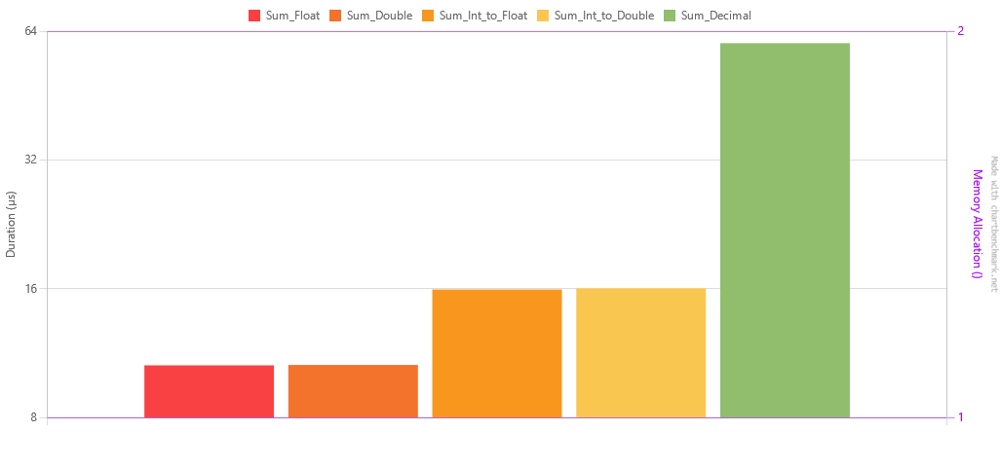

# Numeric operations

So, operations with decimal numbers are more precise with decimal, but slower. That we know. 
Out of curiosity, just to see how much slower, I've made a benchmark.

The test scenarios are as follows:
1. Sum_Decimal: Sum of 1000 decimal numbers
2. Sum_Float: Sum of 1000 float numbers
3. Sum_Double: Sum of 1000 double numbers
4. Sum_Int_to_Float: Sum of 1000 int numbers converted to float
5. Sum_Int_to_Double: Sum of 1000 int numbers converted to double

In scenarios 4 and 5, I had 2 integers, one for the whole number and another for the decimal part.

## Results

| Method            |     Mean |    Error |   StdDev |      Min |      Max |   Median | Rank | Allocated |
|-------------------|---------:|---------:|---------:|---------:|---------:|---------:|-----:|----------:|
| Sum_Float         | 10.60 µs | 0.208 µs | 0.336 µs | 10.06 µs | 11.31 µs | 10.50 µs |    1 |         - |
| Sum_Double        | 10.62 µs | 0.209 µs | 0.393 µs | 10.07 µs | 11.61 µs | 10.52 µs |    1 |         - |
| Sum_Int_to_Float  | 15.94 µs | 0.304 µs | 0.395 µs | 15.11 µs | 16.43 µs | 16.09 µs |    2 |         - |
| Sum_Int_to_Double | 16.03 µs | 0.310 µs | 0.290 µs | 15.20 µs | 16.28 µs | 16.11 µs |    2 |         - |
| Sum_Decimal       | 60.00 µs | 1.168 µs | 1.818 µs | 55.76 µs | 62.92 µs | 59.64 µs |    3 |         - |

