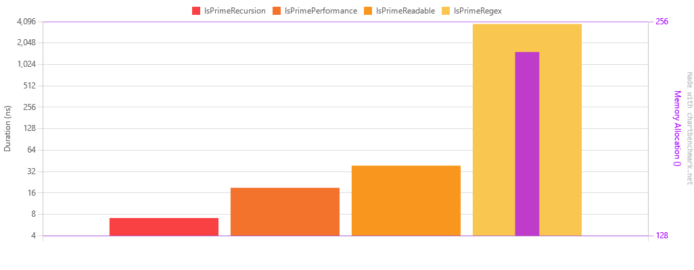

[Readme](./readme.md)


# Prime numbers benchmark
So I found the following regex on the internet that able to match prime numbers. 
I was curious how it would perform against a simple prime number algorithm. 
This one serves no practical use, it's just for fun.

```regexp
/^1?$|^(11+?)\1+$/
```
I'm not nearly intelligent enough to make a pattern like this one. 
I found this regex here: https://www.noulakaz.net/2007/03/18/a-regular-expression-to-check-for-prime-numbers/


# How does this work?
Regex are used to find certain patterns in a string, and they are extremely powerful tools in text processing. 
In this case, we're using them to detect if a number (represented in unary format as a string of 1s) is a prime number.

A prime number is a number that has exactly two distinct positive divisors: 1 and itself. In other words, a prime number
can only be divided by 1 and itself without leaving a remainder. The regular expression in question `/^1?$|^(11+?)\1+$/`
uses this concept to determine if a number is prime.

Here is how the regular expression works:

- The `^1?$` part will match if the string is empty or contains a single '1'. In unary, these correspond to the numbers 
0 and 1, which are not prime. This is to exclude the cases where the input number is 0 or 1.

- `|` acts as a logical OR. It separates the regex into two parts, either of which can match for the entire expression 
to match.

- The `^(11+?)\1+$` part is where the "magic" happens. `(11+?)` matches one or more '1's but at least two because of 
- the initial '11'. The '?' makes the match non-greedy, which means it tries to match as few characters as possible. 
- `\1+` is a backreference, it refers to the sequence that was matched by `(11+?)`. This sequence is then expected to 
- be repeated one or more times (`\1+`) in the string.

Essentially, this part of the regex tries to divide the original number (represented in unary form) by every number less
than itself. If it can be divided evenly (the regex matches), then the number is not prime. If it can't be divided 
evenly by any number other than 1 and itself (the regex does not match), then the number is prime.

## How does counting number of 1s help determine if a number is prime?
For instance, if you need to check if 10 is a prime number, it first must be converted to unary representation.
The conversion of 10 into 1111111111 is a unary representation. Unary is a numeral system where each integer is 
represented by a corresponding number of symbols (in this case, the symbol '1'). So, in unary, 10 becomes '1111111111', 
7 becomes '1111111', and so forth.

Here is how the regular expression uses this unary representation to identify prime numbers:

- The regular expression `^(11+?)\1+$` tries to divide the unary string (the number in unary representation) into 
different groupings of '1's.

- `(11+?)` will first match the smallest nontrivial group of '1's, which is '11' (equivalent to the number 2 in unary).

- The `\1+` then attempts to find additional occurrences of the group matched by `(11+?)` in the rest of the string.

In the case of 10 ('1111111111'), the smallest group '11' can be found five times in the string. 
In other words, '1111111111' can be evenly divided by '11', or in decimal terms, 10 can be evenly divided by 2. 
Therefore, 10 is not a prime number, since it has divisors other than 1 and itself.

If a number is prime, it cannot be evenly divided into smaller groups of '1's beyond the trivial group of a single '1' 
(which represents the number 1) and the group that includes all '1's (which represents the number itself).

For example, consider the number 7, which in unary is '1111111'. The smallest nontrivial group is '11', but '1111111' 
can't be evenly divided by '11'. The regex engine then attempts to divide '1111111' by '111', '1111', and so on, 
but none of these divisions result in an even grouping of '1's. This is because 7 is a prime number—it cannot be 
divided evenly by any number other than 1 and itself.

This is the mathematical logic that underlies the regex prime number test. It's a pretty ingenious way to apply regular 
expressions to a mathematical problem!

# How to use this regex in C#?
Here is how you would implement the function to check if a number is prime using the regex:

```csharp
using System;
using System.Text.RegularExpressions;

public class Program
{
    public static void Main()
    {
        Console.WriteLine(IsPrime(10));  // Output: False
        Console.WriteLine(IsPrime(11));  // Output: True
        Console.WriteLine(IsPrime(12));  // Output: False
        Console.WriteLine(IsPrime(13));  // Output: True
        Console.WriteLine(IsPrime(99));  // Output: False
        Console.WriteLine(IsPrime(100)); // Output: False
        Console.WriteLine(IsPrime(101)); // Output: True
    }

    public static bool IsPrime(int n)
    {
        return !Regex.IsMatch(new String('1', n), @"^1?$|^(11+?)\1+$");
    }
}
```

In this code, `IsPrime` function constructs a string of 1s of length 'n' and then tests it against the regex. 
If it matches, `IsMatch` will return `true` and we negate that to return `false`, because a match means the number is 
not prime. If it does not match, `IsMatch` will return `false` and we negate that to return `true`, because no match 
means the number is prime.


# How will this be tested?
Since it's just for fun, I asked our overlords to write 3 methods so we can compare it with.
1: Focusing on code readability
2: Focusing on performance
3: Using recursion

So we'll have 4 test cases: one for each of the methods and one for the regex and in each test we'll test the 
numbers 0 to 7.

Just to reiterate: this is just for fun.


# Results

| Method             |         Mean |      Error |      StdDev |          Min |          Max |       Median | Rank |   Gen0 | Allocated |
|--------------------|-------------:|-----------:|------------:|-------------:|-------------:|-------------:|-----:|-------:|----------:|
| IsPrimeRecursion   |     7.096 ns |  0.1756 ns |   0.5096 ns |     5.845 ns |     8.310 ns |     6.986 ns |    1 |      - |         - |
| IsPrimePerformance |    18.866 ns |  0.4126 ns |   0.8970 ns |    16.752 ns |    21.098 ns |    18.700 ns |    2 |      - |         - |
| IsPrimeReadable    |    38.717 ns |  0.8105 ns |   1.6557 ns |    34.668 ns |    41.538 ns |    38.985 ns |    3 |      - |         - |
| IsPrimeRegex       | 3,793.532 ns | 83.7620 ns | 245.6594 ns | 3,259.966 ns | 4,346.541 ns | 3,821.337 ns |    4 | 0.0305 |     232 B |




No surprises there: Regex is the slowest by far, but it is still pretty neat the way it works. :) 

