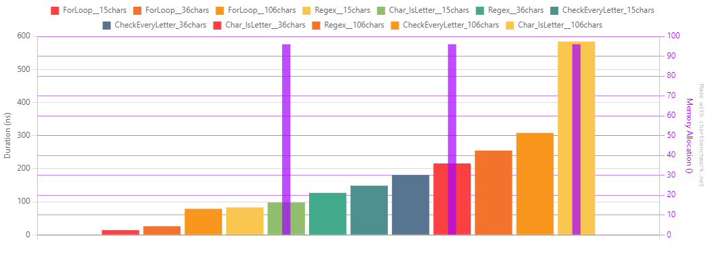

[Readme](./readme.md)

# String Contains letter benchmark
Simple benchmark to check the fastest way to check if a string contains any letter.

I used 3 scenarios:
1. Using char.IsLetter on every character of the string
2. Using Regex to check if the string contains any letter
3. Using a foreach loop to check if the string contains any letter
4. Checking if string contains every letter manually

And for every method I used 3 different strings:
1. One with 15 characters;
2. One with 36 characters;
3. One with 106 characters;

In all cases, the last character of the string as a letter.

To keep things fair, I didn't create any methods to avoid any extra overhead.

# Results
| Method                    |       Mean |     Error |    StdDev |        Min |        Max |    Median | Rank |   Gen0 | Allocated |
|---------------------------|-----------:|----------:|----------:|-----------:|-----------:|----------:|-----:|-------:|----------:|
| ForLoop__15chars          |  0.9939 ns | 0.0562 ns | 0.1210 ns |  0.6479 ns |   1.201 ns |  1.022 ns |    1 |      - |         - |
| ForLoop__36chars          |  1.0775 ns | 0.0573 ns | 0.1568 ns |  0.7525 ns |   1.486 ns |  1.081 ns |    2 |      - |         - |
| ForLoop__106chars         |  1.1202 ns | 0.0577 ns | 0.1561 ns |  0.7076 ns |   1.396 ns |  1.153 ns |    2 |      - |         - |
| CheckEveryLetter_106chars | 11.0072 ns | 0.2553 ns | 0.7489 ns |  9.2790 ns |  12.478 ns | 11.017 ns |    3 |      - |         - |
| CheckEveryLetter_36chars  | 13.4291 ns | 0.3031 ns | 0.8647 ns | 11.2394 ns |  15.284 ns | 13.346 ns |    4 |      - |         - |
| CheckEveryLetter_15chars  | 22.9388 ns | 0.4909 ns | 1.3273 ns | 19.4873 ns |  25.409 ns | 22.923 ns |    5 |      - |         - |
| Char_IsLetter__106chars   | 30.3280 ns | 0.7342 ns | 2.1647 ns | 25.9324 ns |  35.202 ns | 30.244 ns |    6 | 0.0153 |      96 B |
| Char_IsLetter__36chars    | 30.4214 ns | 0.6429 ns | 1.7271 ns | 26.4854 ns |  34.132 ns | 30.541 ns |    6 | 0.0153 |      96 B |
| Char_IsLetter__15chars    | 31.4383 ns | 0.7527 ns | 2.2195 ns | 26.2246 ns |  35.865 ns | 31.559 ns |    7 | 0.0153 |      96 B |
| Regex__106chars           | 87.5616 ns | 1.7722 ns | 4.9401 ns | 74.5559 ns |  99.180 ns | 87.417 ns |    8 |      - |         - |
| Regex__15chars            | 88.8317 ns | 1.8393 ns | 5.4233 ns | 76.8334 ns | 100.587 ns | 88.492 ns |    8 |      - |         - |
| Regex__36chars            | 89.3708 ns | 2.2892 ns | 6.7138 ns | 74.5330 ns | 105.434 ns | 87.850 ns |    8 |      - |         - |

Well, the winning method was the `ForLoop` (no surprises there), which is the most intuitive way to do it. The Regex method was the slowest, 
which is expected. The Char.IsLetter method was the second slowest, which is also expected, since it's a method call. 
Also it was the only method that allocated memory. 
The CheckEveryLetter method was the second fastest, but it's also the most verbose and not very readable.