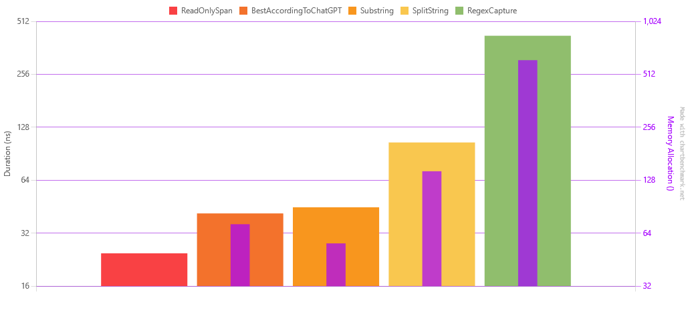

[Readme](./readme.md)

# String Extraction Benchmark
Simple benchmark to check the performance of a few ways to extract some numbers from a string.

For all tests, the string used was: `42--bacon-7`

In some regards, this whole benchmark is biased, because I'm using a fixed string and I already know the indexes of the numbers I want to extract.
The point was to measure the performance of the "main operations".

Scenarios:
1. Substring: Using substrings to extract data
2. ReadOnlySpan: Using ReadOnlySpan to extract data
3. SplitString: Splitting the string and extracting data
4. RegexCapture: Using Regex to extract data
5. BestAccordingToChatGPT: This one is kind of a bonus. I asked Chat GPT to write the most performant function and the most memory efficient function. 
Turns out that, according to Chat GPT, the most performant function is the most memory efficient function.

# Results
| Method                 |      Mean |    Error |   StdDev |       Min |       Max |    Median | Rank |   Gen0 | Allocated |
|------------------------|----------:|---------:|---------:|----------:|----------:|----------:|-----:|-------:|----------:|
| ReadOnlySpan           |  24.58 ns | 0.495 ns | 0.989 ns |  22.40 ns |  26.58 ns |  24.46 ns |    1 |      - |         - |
| BestAccordingToChatGPT |  41.46 ns | 0.856 ns | 1.843 ns |  38.80 ns |  46.43 ns |  41.08 ns |    2 | 0.0114 |      72 B |
| Substring              |  44.92 ns | 0.927 ns | 2.129 ns |  41.07 ns |  50.29 ns |  44.49 ns |    3 | 0.0089 |      56 B |
| SplitString            | 104.92 ns | 2.093 ns | 2.570 ns |  99.30 ns | 109.20 ns | 105.15 ns |    4 | 0.0229 |     144 B |
| RegexCapture           | 423.95 ns | 8.255 ns | 7.721 ns | 405.98 ns | 438.06 ns | 424.18 ns |    5 | 0.0978 |     616 B |

Well, I'll be... The method suggested by Chat GPT was amongst the fastest, not the best one memory-wise, but the second fastest. I'm impressed.

The best one across the board was ReadOnlySpan, which is the one I would have expected to be the fastest, because of the way a Span works.

IMO, the most convenient is the RegexCapture, but it's also the slowest and the one that uses the most memory. I'm still think it's worth it, 
depending on how complex your string is.