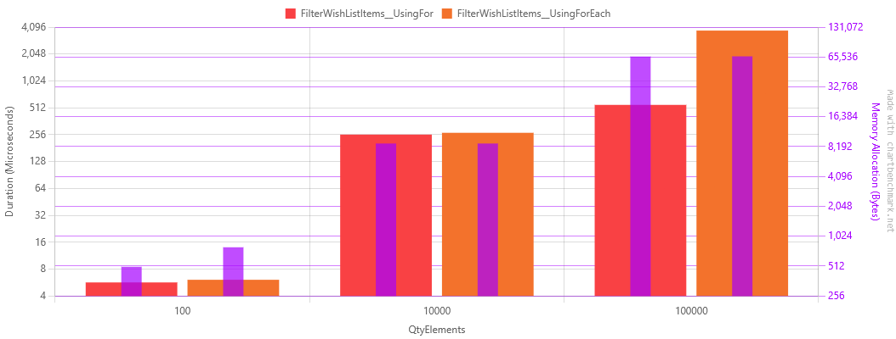

# For Loop vs ForEach Loop Performance Comparison

[Readme](./readme.md)

## Benchmark: For vs ForEach Loop for Filtering WishlistItems

This benchmark compares the performance of two common approaches for processing and filtering collections in C#:

1. Using a standard `for` loop with index-based access
2. Using a `foreach` loop with direct element iteration

Both methods filter a list of wishlist items using the same helper method, but with different iteration techniques.

## Testing Scenarios

The benchmark tests both approaches with three different collection sizes:
- Small: 100 elements
- Medium: 10,000 elements
- Large: 100,000 elements

## What to Expect

In C#, `for` and `foreach` loops have different performance characteristics:

- **For loops** provide direct indexed access to elements which can be more efficient for arrays and certain collections
- **ForEach loops** provide a more elegant syntax but may have overhead from the enumerator

For small to medium-sized collections, both should perform similarly. However, for large collections, the performance
difference might become more noticeable.

## Results

| Method                            | QtyElements |         Mean |      Error |     StdDev |       Median |          Min |          Max | Rank | Allocated |
|-----------------------------------|-------------|-------------:|-----------:|-----------:|-------------:|-------------:|-------------:|-----:|----------:|
| FilterWishListItems__UsingFor     | 100         |     5.667 μs |  0.3417 μs |  0.9694 μs |     5.350 μs |     3.850 μs |     7.950 μs |    1 |     504 B |
| FilterWishListItems__UsingForEach | 100         |     6.068 μs |  0.2579 μs |  0.7275 μs |     5.850 μs |     5.200 μs |     8.500 μs |    1 |     792 B |
| FilterWishListItems__UsingFor     | 10000       |   256.447 μs |  4.7424 μs |  4.4360 μs |   257.300 μs |   248.400 μs |   265.900 μs |    2 |    8800 B |
| FilterWishListItems__UsingForEach | 10000       |   268.448 μs |  5.1676 μs |  6.8986 μs |   267.300 μs |   256.900 μs |   285.300 μs |    2 |    8800 B |
| FilterWishListItems__UsingFor     | 100000      |   551.419 μs | 26.3051 μs | 68.3705 μs |   527.900 μs |   521.600 μs |   884.100 μs |    3 |   66216 B |
| FilterWishListItems__UsingForEach | 100000      | 3,746.179 μs | 52.8642 μs | 46.8628 μs | 3,746.200 μs | 3,668.300 μs | 3,821.700 μs |    4 |   66504 B |

## Analysis

1. **Small Collections (100 elements)**: For small collections, both methods perform similarly with a slight edge to the
`for` loop. The difference is minimal (~0.4μs) and likely insignificant for most applications. The `for` loop uses ~288B
less memory.

2. **Medium Collections (10,000 elements)**: With medium-sized collections, both methods still perform comparably, with
the `for` loop being about 4.5% faster. Memory allocation is identical at 8,800B.

3. **Large Collections (100,000 elements)**: With large collections, we see a dramatic difference:
    - The `for` loop is almost 7x faster than the `foreach` loop
    - The `for` loop processes 100,000 items in ~551μs
    - The `foreach` loop requires ~3,746μs (3.7ms) for the same operation
    - Memory allocation is slightly higher for `foreach` (66,504B vs 66,216B)

## Conclusion

For most everyday scenarios with small to medium collections, both approaches offer similar performance, and code
readability should be the primary consideration. However, when working with large collections (100,000+ items) where
performance is critical, the `for` loop provides significantly better performance.

The benchmark demonstrates that the `for` loop scales much better with larger collections, showing only linear growth
in execution time compared to the `foreach` loop's more dramatic increase at scale.

This performance difference at larger scales is likely due to:
1. The overhead of creating and using enumerators in `foreach` loops
2. CPU cache optimization and memory access patterns
3. JIT compiler optimizations that may work better with index-based access